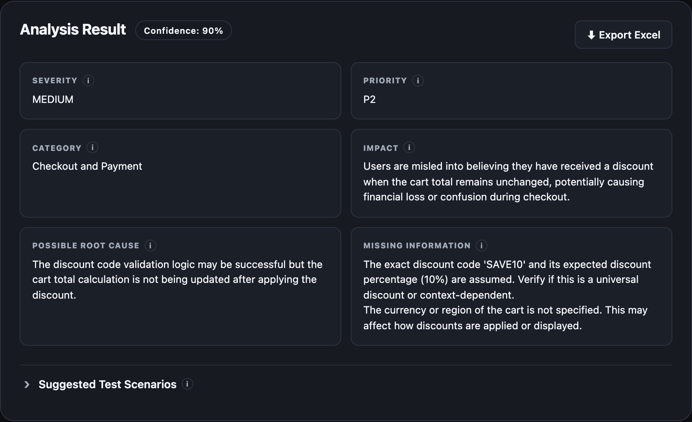
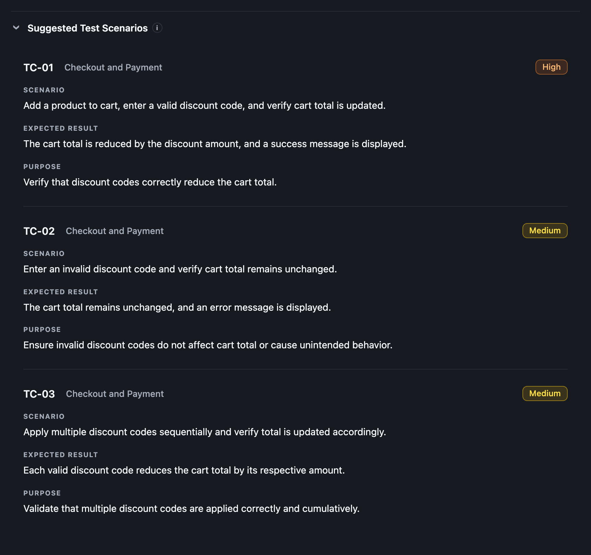
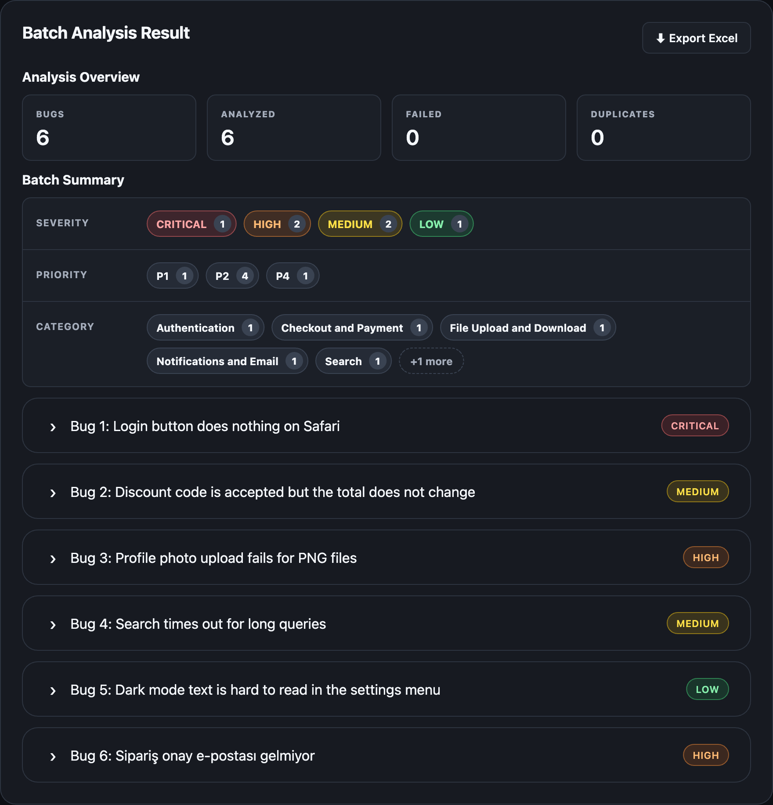
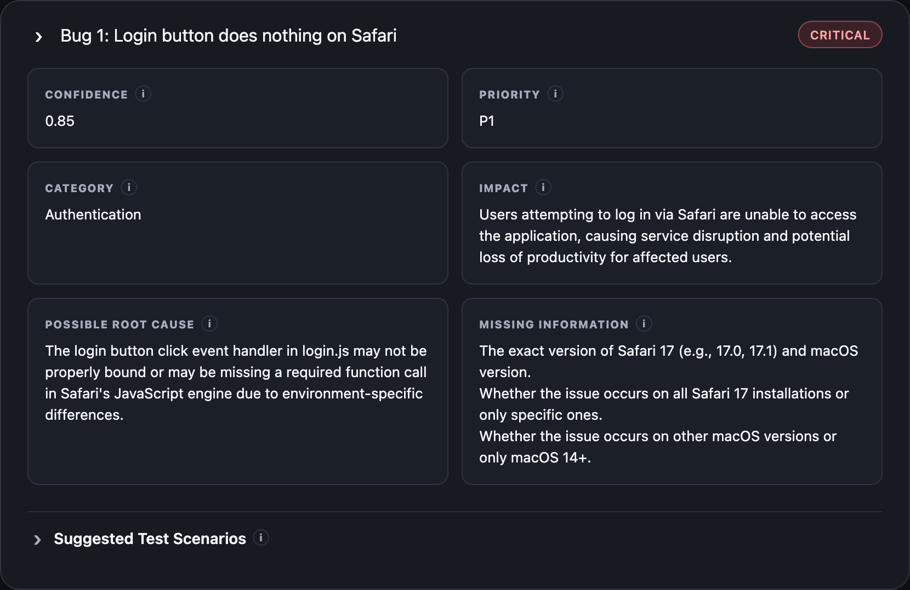
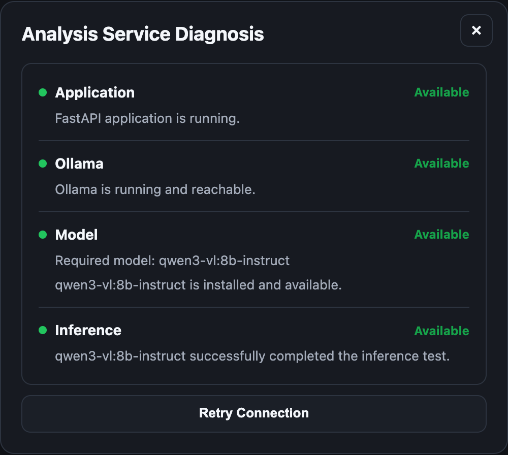

# AI Bug Analyzer

[](https://github.com/berkantepli/ai-bug-analyzer/actions/workflows/tests.yml)

AI Bug Analyzer reads a software bug report and returns a structured QA analysis: how severe the bug is, how urgent it is, what it affects, what might cause it, which tests to run and what information is missing.

You can analyze **one bug** (with screenshots if you have them) or a **whole Excel or CSV file** of bugs at once. Everything runs on your own computer with a local AI model ([Ollama](https://ollama.com) + Qwen3-VL), so no bug report leaves your machine.

> **Note:** This is a learning and portfolio project. The AI's analysis is a suggestion; a QA engineer should review it before treating it as a confirmed finding.

## Screenshots

### Single Bug





### Batch Analysis





### Service Diagnosis



---

## Quick start

You need **Python 3.9+** and **[Ollama](https://ollama.com)**.

```bash
# 1. Get the code and install it
git clone https://github.com/berkantepli/ai-bug-analyzer.git
cd ai-bug-analyzer
python3 -m venv .venv
source .venv/bin/activate        # Windows: .venv\Scripts\activate
pip install -r requirements.txt

# 2. Download the AI model (about 6 GB)
ollama pull qwen3-vl:8b-instruct

# 3. Start the app
uvicorn app.main:app --reload
```

Open <http://127.0.0.1:8000>. The bar at the top shows whether the analysis service is ready. If it says **Unavailable**, click the ⚠ icon next to it to see what is wrong and how to fix it.

---

## How to use it

### Analyze one bug

1. Open the **Single Bug** tab.
2. Fill in the title, description, steps to reproduce, expected result and actual result.
   Write one step per line; numbering such as `1.` or `-` is optional.
3. Optionally add up to **5 screenshots** (PNG, JPEG, WEBP, GIF or BMP, at most 10 MB each).
4. Click **Analyze Bug**. A single bug takes about 20–50 seconds.

### Analyze a file of bugs

1. Open the **Batch Analysis** tab.
2. Choose or drag in an `.xlsx`, `.xls` or `.csv` file (at most 5 MB). See [File format](#file-format) below.
   To try it out, use [`samples/example_bugs.xlsx`](samples/example_bugs.xlsx): six realistic bugs, one of them in Turkish.
3. Click **Analyze Bugs** and follow the progress bar.

### What you get

For each bug:

| Result | What it means |
|---|---|
| **Severity** | `LOW`, `MEDIUM`, `HIGH` or `CRITICAL` |
| **Priority** | `P1` (most urgent) to `P4` |
| **Category** | The functional area, from a fixed list (see below) |
| **Impact** | What the bug means for users or the business |
| **Possible Root Cause** | A likely cause, as a hypothesis |
| **Suggested Test Scenarios** | Tests to verify the fix, with type and priority |
| **Missing Information** | What the report should add to make the bug easier to investigate |
| **Confidence** | How sure the analysis is (0–100%) |
| **Visual Evidence** | What the screenshots show (only when screenshots are added) |

The AI picks the category from this list, in English for reports in any language: Authentication, Authorization, User Interface, Forms and Input, Navigation, Search, Checkout and Payment, File Upload and Download, Notifications and Email, Data and Storage, API and Integration, Reporting and Export, Performance, Stability and Crashes, Security, Accessibility, Localization, Compatibility, Settings and Configuration, and Other. A Category column in your file is used as written instead.

A batch result also shows a summary: how many bugs were analyzed and failed (and repeated or not analyzed, when there are any), and how they split by severity, priority and category.

**Filter a batch result** by clicking the summary: a count such as **Failed** shows only those bugs, and severity, priority and category values narrow the list further. Click **Clear filters** to see all bugs again.

Click **⬇ Export Excel** to download the result as an `.xlsx` report. For a batch, choose **Filtered bugs** to export only the bugs you are looking at (the report lists the filters used) or **All bugs** for the whole file.

---

## Good to know

- **Any language.** The analysis is written in the language of the report, for example English, Turkish or German. Severity, priority and category stay in English so results can be compared.
- **Poor input is rejected with a reason**: empty fields, random characters (`asdfasdf`), placeholder text (`test test`, `lorem ipsum`), the same text in two fields, or text that is not a bug report at all. Short but real reports such as "It does not work" are still analyzed, with low confidence.
- **Screenshots of another page** do not block the analysis; the mismatch is explained and confidence is lowered.
- **In a batch, one bad row never stops the rest.** Problem rows are marked **FAILED** with the reason; hover over the badge to read it. Repeated bugs are marked **DUPLICATE OF BUG N** and are not analyzed twice.
- **If Ollama stops during a batch,** the remaining bugs are marked **NOT ANALYZED**. When Ollama is back, the **Retry** button analyzes only those, without uploading the file again.
- **If the AI gives an unusable answer twice,** the bug is marked **FAILED** and the **Retry** button can send it again too. Rows that failed for another reason, such as an empty field, fail again until the file is fixed.
- **One thing at a time.** Ollama handles one request at a time. Starting a single bug while a batch runs (or the other way round) shows a warning that it will wait.
- **Light or dark.** The switch at the top right changes the theme, and the browser remembers your choice.
- **Results live in the page.** Clear cancels a running analysis, and leaving the page asks for confirmation first. Export to Excel to keep a result.

---

## File format

Use **one sheet** with a header row and one bug per row. The header row may be anywhere in the first 20 rows.

| Column | Required | Recognized headers |
|---|---|---|
| Title | ✅ | Title, Bug Title, Bug Name |
| Description | ✅ | Description, Bug Description |
| Steps to Reproduce | ✅ | Steps to Reproduce, Steps, Reproduction Steps |
| Expected Result | ✅ | Expected Result, Expected Behavior |
| Actual Result | ✅ | Actual Result, Actual Behavior |
| Severity | – | Severity, Bug Severity, Issue Severity |
| Priority | – | Priority, Bug Priority, Issue Priority |
| Category | – | Category, Bug Category, Type, Bug Type |

- **Headers in other languages** (for example `Başlık`, `Beschreibung`) are matched by the AI. The page shows which column was used for which field so you can check it.
- **Severity, Priority and Category** from your file replace the AI's values. Common values from tools such as Jira, Bugzilla, Azure DevOps and ServiceNow are understood (`Blocker` → CRITICAL, `Major` → HIGH, `Highest` → P1, `Sev 2` → HIGH, `Yüksek` → HIGH).
- **Limits:** 5 MB, 2000 rows with data and 500 bugs per file.
- **Hidden or filtered rows** are skipped, and the page tells you how many.
- **Two columns for the same field** (for example two Title columns, or Title and Bug Title): only the first is read, and the page tells you which columns were ignored.
- **CSV files** may use commas, semicolons or tabs, in UTF-8, UTF-16 or Windows Turkish encoding.
- **Not supported:** password-protected files. Cells showing Excel errors such as `#N/A` fail with the cell named, and formulas without a saved result ask you to open and save the file in Excel.

---

## How it works

```text
Bug report (+ screenshots)
        │
        ▼
Quick checks in the app ─────▶ rejected: empty, unreadable, placeholder or repeated text
        │
        ▼
AI step 1: read the text ────▶ rejected: not a real bug report
  and detect its language
        │
        ▼
AI step 2: analyze the report and the screenshots
  in the detected language
        │
        ▼
Result in the page (and as an Excel report)
```

The AI must answer in a fixed JSON format, so every result has the same fields. An answer that does not fit is requested once more before the bug is marked as failed.

---

## Security and limitations

The app is meant to run **on your own computer for one user**:

- It has **no login**. Keep the default address (`127.0.0.1`) and do not start it with `--host 0.0.0.0` on a shared network.
- Other websites open in your browser cannot start analyses.
- Uploads are limited in size and type, and Excel files are read safely.
- A bug report could contain instructions aimed at the AI. The app tells the AI to ignore them, but do not trust the analysis of reports from unknown sources blindly.
- A local 8B model is slower than cloud AI: a batch of hundreds of bugs can take hours.
- The results are suggestions, not confirmed defects or root causes.

---

## For developers

**Tech stack:** Python, FastAPI, Pydantic, Ollama (`qwen3-vl:8b-instruct`), openpyxl and xlrd for spreadsheets, plain HTML/CSS/JavaScript without a build step, pytest.

**Configuration:** The Ollama address, model name and context window are in `app/config.py`. The app asks Ollama for a 16,384-token context window so reports with several screenshots fit; the model then uses about 7.7 GB of memory.

**Tests:** Run `pytest`. The AI is mocked, so Ollama does not need to run. GitHub Actions runs the tests on every push and pull request.

**Sample files:** [`samples/error-scenarios`](samples/error-scenarios) has an Excel, CSV or screenshot file for each error a user can run into, with the message the app gives for each one.

**Project structure:**

```text
app/
├── api/bugs.py              # Analysis, batch, retry and Excel export endpoints
├── api/health.py            # Service status and diagnosis
├── services/
│   ├── llm_analyzer.py      # Prompts and Ollama calls
│   ├── batch_analyzer.py    # Reading Excel and CSV files
│   ├── readability.py       # Checks for unusable text
│   ├── steps.py             # Splitting steps to reproduce
│   ├── excel_values.py      # Mapping severity and priority values
│   └── report.py            # Excel reports
├── schemas/                 # Input and result formats
├── static/                  # CSS, JavaScript and images
├── templates/index.html     # The page
└── main.py                  # App setup
tests/                       # pytest suite
```

**API** (interactive docs at `/docs` while the app runs):

| Method | Endpoint | Purpose |
|---|---|---|
| `POST` | `/bugs/analyze` | Analyze one bug |
| `POST` | `/bugs/batch` | Analyze an Excel or CSV file |
| `POST` | `/bugs/batch/retry` | Analyze bugs from an earlier batch again |
| `GET` | `/bugs/batch/{batch_id}/progress` | Progress of a running batch |
| `GET` | `/bugs/activity` | Whether an analysis is running |
| `POST` | `/bugs/export/single` | Excel report of a single bug result |
| `POST` | `/bugs/export/batch` | Excel report of a batch result |
| `GET` | `/health` | Whether the app is running |
| `GET` | `/health/ollama` | Whether Ollama is reachable and the model is installed |
| `GET` | `/health/analysis` | Whether the analysis service is ready |
| `GET` | `/health/analysis/diagnose` | Step-by-step service diagnosis |

---

## License

Released under the [MIT License](LICENSE).
